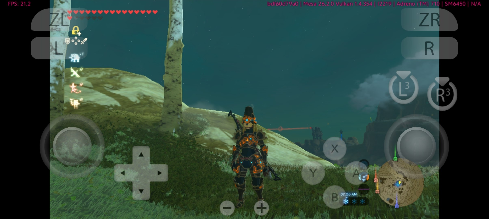
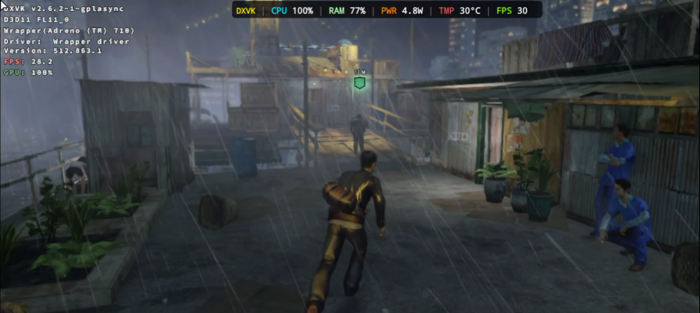

# Mesa Turnip for Adreno 710 / 720 / 722

Custom-built Turnip (Mesa Freedreno Vulkan driver) for Android, targeting three Adreno A7-series GPUs that upstream Mesa does not officially list as supported. Built for use with Android emulators and native games via driver-swap frontends (e.g. Winlator, GameHub-style loaders).

## Supported GPUs and Their Host Chipsets

Adreno GPU model numbers are shared across multiple Snapdragon chipset tiers, each with a different CPU. This driver targets the **GPU silicon**, not a specific phone, so it should work across all chipsets below — but CPU performance (and therefore real framerate) will vary by device.

| Adreno GPU | Snapdragon chipsets using it |
|---|---|
| **710** | 7s Gen 2, 6 Gen 1, 6 Gen 3, 6s Gen 4 |
| **720** | 7 Gen 3 |
| **722** | 7 Gen 4 |

## Before You Use

- Read the release notes for the specific build you're downloading — behavior differs meaningfully between Mesa 24.x, 25.x, and 26.x branches.
- Check the "known issues" section on each release page before reporting a bug.

## Recommended Usage

- Use **sysmem** mode for better stability on all three GPUs — GMEM mode is more prone to rendering artifacts on this unsupported configuration. Enable it by setting the environment variable `TU_DEBUG=sysmem` before launching the game/emulator.

## Testing

<p align="center">
  
  
</p>

## Available Builds

**Mesa 26.x** (main branch)
[Releases →](https://github.com/Vauzi-17/710/releases)

**Mesa 25.x** (multiple variant builds)
[Releases →](https://github.com/Vauzi-17/710/releases/tag/m25_710-720-722)

**Mesa 24.3.4** (legacy branch)
- [r1](https://github.com/Vauzi-17/710/releases/tag/m24.3.4_710-720-722)
- [r2](https://github.com/Vauzi-17/710/releases/tag/m24.3.4_710-720-722_r2)

Note: in our testing, Mesa 24.3.4 tends to run lower FPS than Mesa 26.x on the same workloads. Try 26.x first unless you have a specific compatibility reason to use the legacy branch.

## Support

Questions or issues: **[t.me/vauzi_17](https://t.me/vauzi_17)**

## Credits

- [whitebelyash](https://github.com/whitebelyash/mesa-tu8) — original A8XX Mesa patchset (gen8 branch) this work is based on
- [Mesa Project](https://gitlab.freedesktop.org/mesa/mesa) — upstream Turnip/Freedreno Vulkan driver


Old README:
<details>
  This is a bash script to build freedreno/turnip for android as a magisk module and an Adreno Tools driver package.

### Scheduled Releases
- Automated releases at 06:00 UTC on the 1st and 15th of each month.

### Notes;

#### Magisk build:
- Root must be visible to target app/game.
- Tested with these apps/games listed [here](list.md).

#### Adreno Tools build:
- Follow application specific instructions to install the driver package.

### To Build Locally
- Obtain the script [turnip_builder.sh](https://raw.githubusercontent.com/ilhan-athn7/freedreno_turnip-CI/main/turnip_builder.sh) on your linux environment. (visit the link and use ```CTRL + S``` keys)
- Execute script on linux terminal ```bash ./turnip_builder.sh```
- To build experimental branchs, change [this](https://github.com/ilhan-athn7/freedreno_turnip-CI/blob/6ef9860e7b755b8b7a83e4ecd398b355a56f9d49/turnip_builder.sh#L11) line, and add one more line to rename unzipped folder to mesa-main.

### References

- https://forum.xda-developers.com/t/getting-freedreno-turnip-mesa-vulkan-driver-on-a-poco-f3.4323871/

- https://gitlab.freedesktop.org/mesa/mesa/-/issues/6802

- https://github.com/bylaws/libadrenotools

</details>
